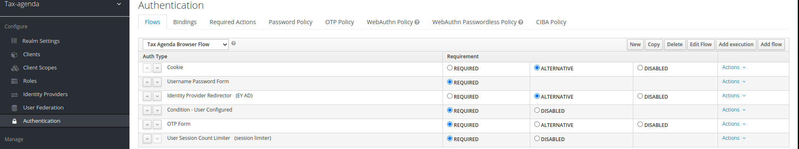
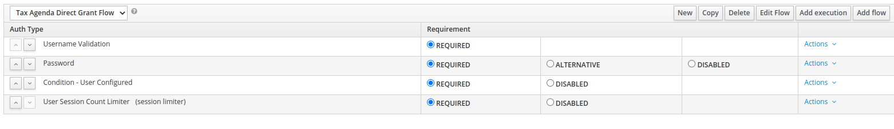
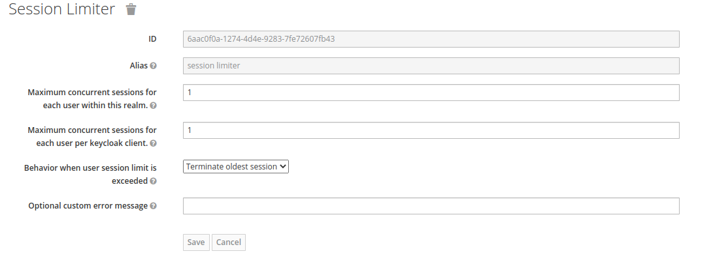
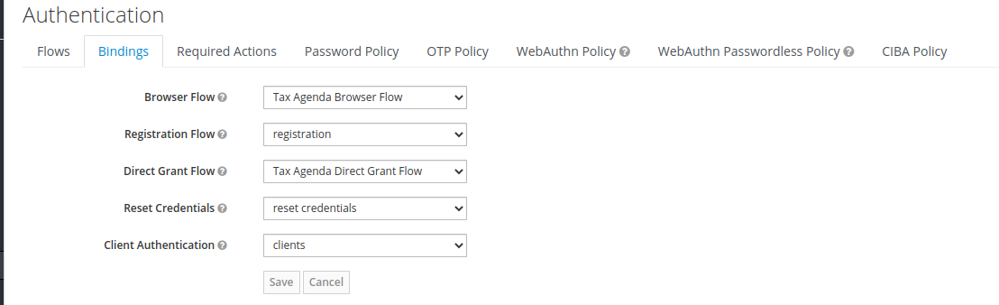
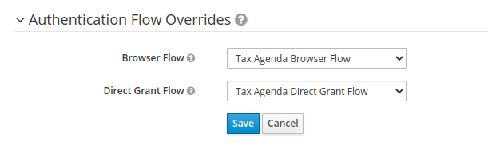
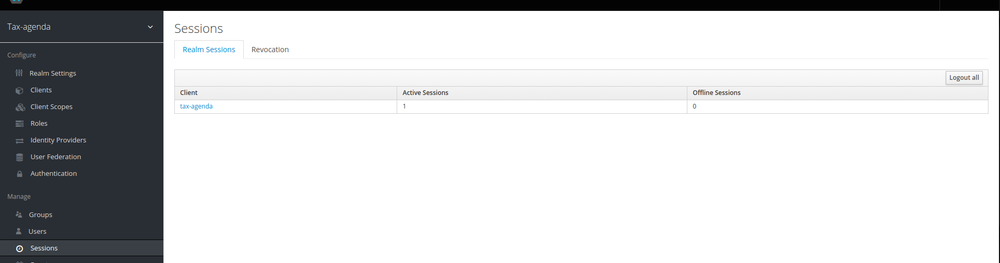

### Do poprawnego działania musimy zainstalować certyfikat do naszego JVM

#### Rozwiązanie na teraz, nie znalazłem lepszego, certyfikat lokalny wygenerowany przez keycloaka jest uznawany jako nie zaufany ponieważ sami go stworzyliśmy...

NOTE: Można użyć LetsEncrypt i wygenrować darmowy SSL, który jest rozpoznawany przez wszystkie przegladaki - ale trzeba mieć domenę a aplikacja musi być dostepna publicznie. Można wygenerować własny certyfikac CA i za jego pomocą wystawić certy dla aplikacji. Wtedy wystarczy dodać do przeglądarki jeden certyfikat jako zaufane CA, a wszystkie certyfikaty podpisane przet to CA będą zaufane.

Go to URL in your browser:
firefox - click on HTTPS certificate chain (the lock icon right next to URL address). Click "more info" > "security" > "show certificate" > "details" > "export..". Pickup the name and choose file type example.cer
chrome - click on site icon left to address in address bar, select "Certificate" -> "Details" -> "Export" and save in format "Der-encoded binary, single certificate".
Now you have file with keystore and you have to add it to your JVM. Determine location of cacerts files, eg. C:\Program Files (x86)\Java\jre1.6.0_22\lib\security\cacerts.

Next import the example.cer file into cacerts in command line (may need administrator command prompt):

keytool -import -alias example -keystore  "C:\Program Files (x86)\Java\jre1.6.0_22\lib\security\cacerts" -file example.cer

You will be asked for password which default is changeit

Restart your JVM/PC.

https://stackoverflow.com/questions/21076179/pkix-path-building-failed-and-unable-to-find-valid-certification-path-to-requ

### User Session Limiter - limit sesji dla jednego użytkownika w keycloaku

Aby ustawić limit sesji dla użytkownika musimy najlepiej stworzyć nowe flow (Keycloak ver <19) lub w nowszym Keycloaku >=19 można to zrobić tworząć nowe flow a istniejące flow dodać jako subflow.

Logujemy się do konsoli keycloaka, wybieramy naszego realma następnie -> Authentication 

Aby dodać session limiter musimy dodać 2 nowe flow (jedno dla przeglądarki, drugie dla direct grant czyli bezpośredniego uderzania po token np. z postmana)

Czyli klikamy w Authentication klikamy new dajemy nazwę np. My Project Name Browser Flow + tworzym drugie My Project Name Direct Grant Flow

Następnie przykładowo dla naszego browser flow klikamy Add Execution i dodajemy takie same kroki jak są w domyślnym browser flow keyclokowym (można pominąć kroki które uważamy za zbędne)

Tak samo robimy dla direct grant flow 

Dla Keycloaka w wersji 18 takie browser flow powinno przykładowo wyglądać tak: 

Dla direct grant flow: 

Tak jak widzimy na zdjęciach na końcu widnieje User Session Counter Limiter - dodajemy go tak samo jak inne ( przez add exection) na końcu naszego flow jako required.

#### Uwaga samo dodanie tego kroku nie wystarczy musimy też go odpowiedno skonfigurować więc obok kroku klikamy Actions -> Config 

Przykładowa konfiguracja która powoduje że jeśli użytkownik wyśle requesta a ma już sesje to poprzednia jest ubijana i tworzymy nową. Istnieje też druga opcja że gdy ma już sesję to odmawiamy mu nową wyrzucając error.

### Uwaga! Ważność kroków jest ważna (dajemy user session limiter na końcu)
### Następnie nie możemy zapomnieć aby to nasze nowe stworzone flow przypisać dla naszego realma lub clienta w zależności jak chcemy.

#### Dla realma przechodzimy do podzakładki "Bindings" w zakładce Authentication i ustawiamy nasze nowe flow

#### Dla clienta przechodzimy do Clients wybieramy naszego clienta zjeżdzamy w dół i w Authentication Flow Overrides nadpisujemy flow

#### Poprawność działania możemy przetestować Postmanem uderzając kilka razy po token w przypadku takich jak przedstawiłem wyżej dla session limitera w zakładce Session w keycloaku powinniśmy mieć 1 aktywną sesję u nas lokalnie

#### Przydatne linki : 
https://github.com/keycloak/keycloak/issues/10077

https://www.keycloak.org/docs/latest/server_admin/index.html#_step-up-flow

